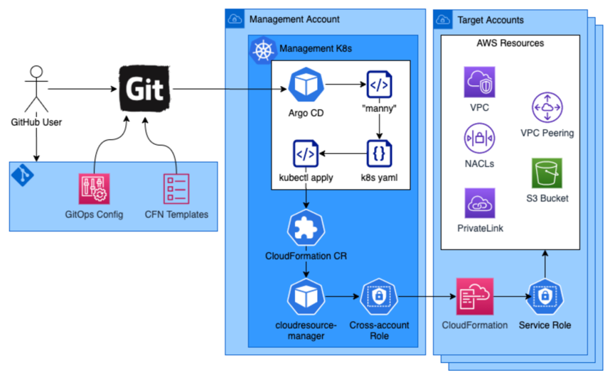

# CFN-Controller

[![Build Status][BuildStatusImg]][BuildMasterURL]
[![Code Coverage][CodecovImg]][CodecovURL]

<h3> Overview </h3>
The Cloud Resource Controller provides a mechanism to deploy AWS resources needed for Kubernetes clusters (cluster prerequisites) and applications running on these clusters. The Cloud Resource Controller leverages Argo CD which is a declarative, GitOps continuous delivery tool for Kubernetes.  

 Argo CD follows the GitOps pattern of using Git repositories as the source of truth for defining the desired state. Argo CD automates the deployment of the desired states in the specified target environments. However, since Argo CD currently only handles resources that are represented in Kubernetes, a custom kubernetes controller is used to create resources with CloudFormation stacks from Kubernetes control plane on AWS.

Design Diagram

## Run in a cluster
To run this controller in a cluster run the following steps:

- make install
- make docker-build
- docker tag controller:latest username/cf:v1 or docker-artifactory-path:/cf:v1
- docker push <username>/cf:v1  or docker push docker-artifactory-path:/cf:v1
- update the docker image name in makefile
- make deploy

<!-- URLs -->
[BuildStatusImg]: 
[BuildMasterURL]: 
[CodecovImg]: 
[CodecovURL]: 
