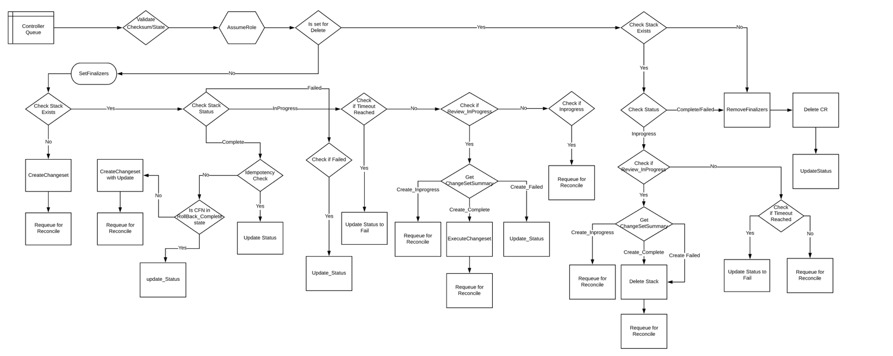

<h1>CloudFormation Stack State handling</h1>

Though a CloudFormation stack could exist in any one of the 22 states, we are interested in only 17 of them as we do not support importing external resources into a stack.
These 17 states have further been categorized into intermittent and terminal states. A terminal state is one in which the stack remains until an operation is triggered on the stack by the user whereas an intermittent state is one in which the stack temporarily exists while the user triggered operation is being executed. 

The terminal states have been labelled as “Success” and “Failure”. The terminal state that is reached when cloud resources from ArogCD are synced and execution is successful is marked as “Success” and the remaining terminal states are marked as “Failure”. The “REVIEW_IN_PROGRESS” state is marked as “Success” if the create changeset is successful. Similarly, the CREATE_COMPLETE, UPDATE_COMPLETE and DELETE_COMPLETE states correspond to the successful execution of the create, update and delete operations respectively. 

Similarly, CREATE_FAILED, DELETE_FAILED, ROLLBACK_FAILED and UPDATE_ROLLBACK_FAILED have all been marked as ‘Failure’ states. Though ROLLBACK_COMPLETE and UPDATE_ROLLBACK_COMPLETE indicate successful rollbacks, we mark them as “Failure” states as the rollbacks were triggered in the first place as the user triggered update operations did not go through successfully. 

The states and their corresponding categories can be tabulated as follows:

 
<table>
<thead>
  <tr>
    <th rowspan="2"> Intermittent States </th>
    <th>Terminal States</th>
    <th></th>
  </tr>
  <tr>
    <td><b>Success</td>
    <td><b>Failure</td>
  </tr>
</thead>
<tbody>
  <tr>
    <td>CREATE_IN_PROGRESS</td>
    <td>REVIEW_IN_PROGRESS</td>
    <td>CREATE_FAILED</td>
  </tr>
  <tr>
    <td>DELETE_IN_PROGRESS</td>
    <td>CREATE_COMPLETE</td>
    <td>DELETE_FAILED</td>
  </tr>
  <tr>
    <td>ROLLBACK_IN_PROGRESS</td>
    <td>DELETE_COMPLETE</td>
    <td>ROLLBACK_FAILED</td>
  </tr>
  <tr>
    <td>UPDATE_COMPLETE_CLEANUP_IN_PROGRESS</td>
    <td>UPDATE_COMPLETE</td>
    <td>UPDATE_ROLLBACK_FAILED</td>
  </tr>
  <tr>
    <td>UPDATE_IN_PROGRESS</td>
    <td>ROLLBACK_COMPLETE</td>
    <td></td>
  </tr>
  <tr>
    <td>UPDATE_ROLLBACK_COMPLETE_CLEANUP_IN_PROGRESS</td>
    <td>UPDATE_ROLLBACK_COMPLETE</td>
    <td></td>
  </tr>
  <tr>
    <td>UPDATE_ROLLBACK_IN_PROGRESS</td>
    <td></td>
    <td></td>
  </tr>
</tbody>
</table>

Based on the which of the above categories the current state of the stack is in, the controller takes the corresponding action as mentioned below (at a high level):

<ol>
    <li>Success terminal state</li>
    &nbsp;&nbsp;&nbsp;&nbsp;If the controller learns that the stack has reached a Successful terminal state, then it informs the user of the same.
    <li>Failure terminal state</li>
    &nbsp;&nbsp;&nbsp;&nbsp;If the controller learns that the stack has reached a Failure terminal state, then it informs the user of the same and outputs that a human intervention is needed.
        
If stack has reached rollback-complete or update-rollback-complete state, controller compare the CRs current template body and parameters with failed changeset's values not the stack's. This will ensure controller 
doesn't reconcile multiple times.
  <li>Intermittent State</li>
    &nbsp;&nbsp;&nbsp;&nbsp;If the CouldFormation stack is in an intermittent state, the controller does not take any action but rather polls for the status after a small interval of time (i.e during the upcoming reconciliation)
</ol>

The above description is a high level overview of the functioning of the controller. The detailed functioning can be illustrated as follows:

Flow Diagram
